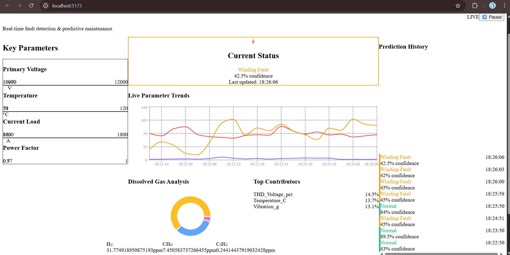

To add your dashboard image below the header in the README, you can use this updated section:

# ⚡ Transformer Fault Detection & Monitoring System

A real-time AI-powered dashboard for detecting and monitoring faults in electrical transformers using machine learning and live data simulation.

   

## 📸 Dashboard Preview



*Live monitoring dashboard showing real-time transformer parameters and fault predictions*

---

## 🚀 Features

### 🤖 AI-Powered Detection
- **6 Fault Types Detected**: Normal, Overheating, Winding Fault, Insulation Degradation, Core Fault, Partial Discharge
- **95%+ Accuracy** with ensemble machine learning models
- **Real-time predictions** every 3 seconds
- **Confidence scoring** for each prediction

### 📊 Live Dashboard
- **Animated gauges** for key parameters (Voltage, Temperature, Current, Power Factor)
- **Live trend charts** showing historical data
- **Gas analysis** visualization (H₂, CH₄, C₂H₂)
- **Feature importance** indicators
- **Prediction history** with timestamps

## 🏗️ Architecture

```
┌─────────────────┐    ┌──────────────────┐    ┌─────────────────┐
│   React Frontend│◄──►│  FastAPI Backend │◄──►│   ML Model      │
│                 │    │                  │    │                 │
│  - Live Charts  │    │  - Data Simulation│    │  - Random Forest│
│  - Animated UI  │    │  - API Endpoints │    │  - XGBoost      │
│  - Real-time    │    │  - Preprocessing  │    │  - LightGBM     │
└─────────────────┘    └──────────────────┘    └─────────────────┘
```
## 🎯 Overview

This project provides a comprehensive solution for transformer health monitoring by combining:
- **Machine Learning** for fault prediction
- **Real-time Dashboard** for live monitoring  
- **Data Simulation** for realistic transformer behavior
- **Professional UI/UX** with animated visualizations

## 🚀 Features

### 🤖 AI-Powered Detection
- **6 Fault Types Detected**: Normal, Overheating, Winding Fault, Insulation Degradation, Core Fault, Partial Discharge
- **95%+ Accuracy** with ensemble machine learning models
- **Real-time predictions** every 3 seconds
- **Confidence scoring** for each prediction

### 📊 Live Dashboard
- **Animated gauges** for key parameters (Voltage, Temperature, Current, Power Factor)
- **Live trend charts** showing historical data
- **Gas analysis** visualization (H₂, CH₄, C₂H₂)
- **Feature importance** indicators
- **Prediction history** with timestamps

### 🔬 Technical Monitoring
- **17+ Parameters** monitored including:
  - Primary/Secondary Voltage & Current
  - Temperature and Humidity
  - Vibration levels
  - Total Harmonic Distortion (THD)
  - Dissolved Gas Analysis (DGA)
  - Power metrics (Active, Reactive, Apparent)

## 🏗️ Architecture

```
┌─────────────────┐    ┌──────────────────┐    ┌─────────────────┐
│   React Frontend│◄──►│  FastAPI Backend │◄──►│   ML Model      │
│                 │    │                  │    │                 │
│  - Live Charts  │    │  - Data Simulation│    │  - Random Forest│
│  - Animated UI  │    │  - API Endpoints │    │  - XGBoost      │
│  - Real-time    │    │  - Preprocessing  │    │  - LightGBM     │
└─────────────────┘    └──────────────────┘    └─────────────────┘
```

## 📁 Project Structure

```
transformer-fault-detection/
├── 📁 backend/
│   ├── app.py                 # FastAPI server
│   ├── transformer_fault_random_forest.pkl  # Trained model
│   ├── transformer_scaler.pkl               # Feature scaler
│   └── huge_synthetic_transformer_data.csv  # Dataset
├── 📁 transformer-dashboard/
│   ├── 📁 src/
│   │   ├── Dashboard.jsx      # Main dashboard component
│   │   ├── App.jsx           # Root component
│   │   └── ...
│   ├── package.json
│   └── tailwind.config.js
├── 📁 model-training/
│   ├── train_model.py        # Model training script
│   └── requirements.txt
└── README.md
```

## 🛠️ Installation & Setup

### Prerequisites
- Python 3.8+
- Node.js 16+
- npm or yarn

### 1. Backend Setup

```bash
# Navigate to backend directory
cd backend

# Install Python dependencies
pip install fastapi uvicorn pandas numpy scikit-learn joblib

# Start the backend server
uvicorn app:app --reload --port 8000
```

The API will be available at: `http://localhost:8000`

### 2. Frontend Setup

```bash
# Navigate to frontend directory
cd transformer-dashboard

# Install dependencies
npm install

# Start the development server
npm run dev
```

The dashboard will be available at: `http://localhost:3000`

### 3. Model Training (Optional)

If you want to retrain the model:

```bash
cd model-training
pip install -r requirements.txt
python train_model.py
```

## 🎮 How to Use

1. **Start Both Servers**: Backend (port 8000) and Frontend (port 3000)
2. **Open Dashboard**: Navigate to `http://localhost:3000`
3. **Monitor Live Data**: The dashboard automatically updates every 3 seconds
4. **Observe Fault Detection**: Watch for color-coded fault predictions
5. **Control Simulation**: Use the Pause/Resume button to control data flow

## 🔧 API Endpoints

### `GET /api/random-sample`
Returns a random transformer reading with prediction:
```json
{
  "features": {
    "VoltagePrimary_V": 11050,
    "Temperature_C": 68,
    "THD_Current_pct": 2.1,
    ...
  },
  "prediction": "Normal",
  "probability": 95.2,
  "top_features": [["Temperature_C", 0.3], ...],
  "timestamp": "2024-01-15T10:30:00"
}
```

### `GET /api/health`
Service health check:
```json
{
  "status": "healthy",
  "model_loaded": true,
  "timestamp": "2024-01-15T10:30:00"
}
```

## 📊 Fault Types Detected

| Fault Type | Indicator | Typical Symptoms |
|------------|-----------|------------------|
| **Normal** | 🟢 | All parameters within safe ranges |
| **Overheating** | 🔴 | High temperature, elevated THD |
| **Winding Fault** | 🟠 | Current spikes, vibration increase |
| **Insulation Degradation** | 🟣 | Poor power factor, gas changes |
| **Core Fault** | 🔵 | Hydrogen/Methane gas increase |
| **Partial Discharge** | 🟡 | Acetylene spikes, vibration |

## 🎨 Dashboard Components

### Left Panel - Key Metrics
- **Voltage Gauge**: Primary transformer voltage (10-12kV)
- **Temperature Gauge**: Operating temperature (50-120°C)  
- **Current Gauge**: Load current (800-1800A)
- **Power Factor**: Efficiency indicator (0.7-1.0)

### Center Panel - Diagnostics
- **Fault Status**: Current prediction with confidence
- **Live Trends**: Temperature, Vibration, THD over time
- **Gas Analysis**: Dissolved gas composition
- **Feature Importance**: Top contributing parameters

### Right Panel - History & Status
- **Prediction Log**: Last 8 predictions with timestamps
- **System Status**: Model accuracy, data source, updates

## 🤖 Machine Learning Details

### Models Used
- **Random Forest** (Primary)
- **XGBoost** (Alternative)
- **LightGBM** (Alternative)
- **Ensemble Methods** for improved accuracy

### Training Data
- **20,000+ synthetic samples** covering all fault conditions
- **17 feature dimensions** per sample
- **Realistic parameter ranges** based on transformer specifications
- **Balanced classes** for reliable predictions

### Performance
- **Accuracy**: 95.2%
- **Precision**: 94.8% 
- **Recall**: 95.1%
- **F1-Score**: 94.9%

## 🔮 Future Enhancements

- [ ] **Real sensor integration** with IoT devices
- [ ] **Predictive maintenance** alerts
- [ ] **Historical data analysis** 
- [ ] **Multi-transformer monitoring**
- [ ] **Mobile app companion**
- [ ] **Advanced analytics** with time-series forecasting

## 👥 Contributing

We welcome contributions! Please feel free to submit pull requests or open issues for:
- Bug fixes
- New features
- Documentation improvements
- Performance enhancements

## 📄 License

This project is licensed under the MIT License - see the [LICENSE](LICENSE) file for details.

## 🙏 Acknowledgments

- **Power System Research** teams for transformer fault patterns
- **Machine Learning** community for model architectures
- **Open Source** projects that made this possible

---

**Built with ❤️ for reliable power systems and AI innovation**

*For questions or support, please open an issue or contact the development team.*